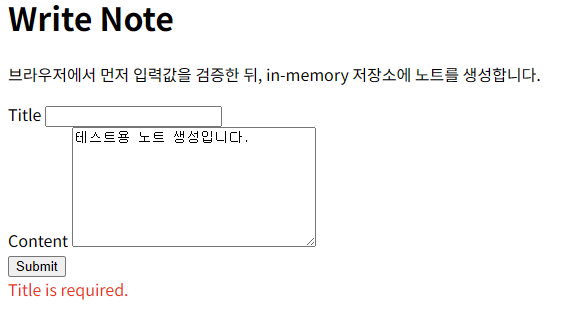
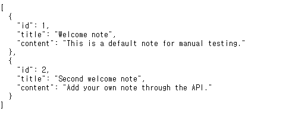
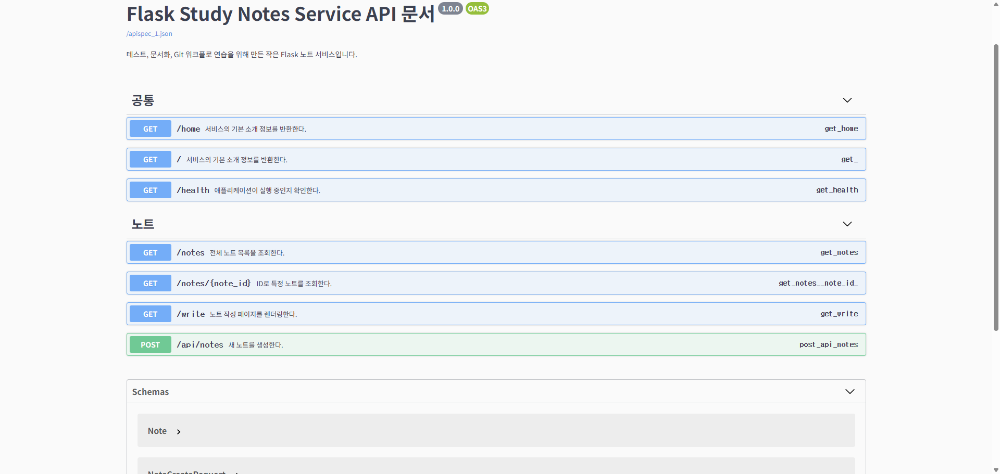
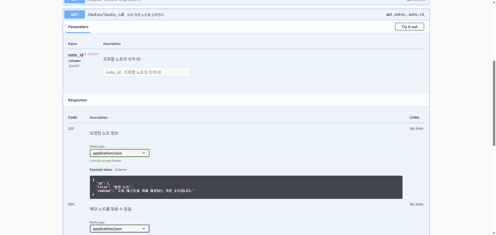
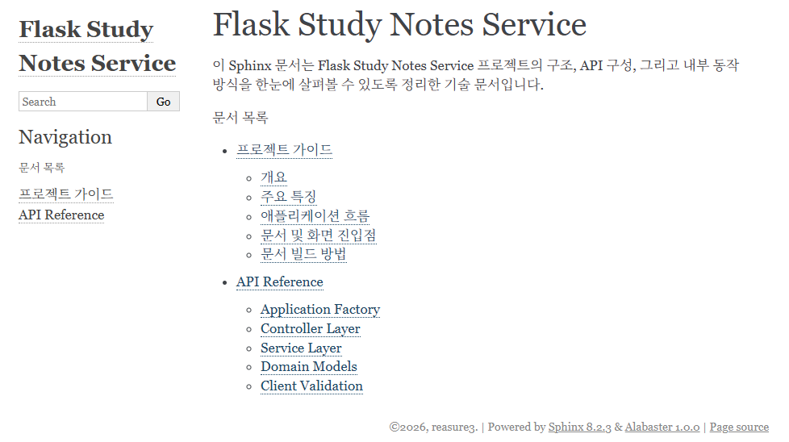

# Flask Study Notes Service

[](https://www.python.org/)
[](https://flask.palletsprojects.com/)
[](https://reasure3.github.io/opensource-flask-blog/)
[](http://127.0.0.1:5000/apidocs/)

테스트 가능한 Flask 노트 API를 바탕으로, API 문서화와 기술 문서화, 그리고 GitHub Pages 배포까지 한 번에 보여주는 포트폴리오 프로젝트입니다.

이 프로젝트에서는 다음 내용을 확인할 수 있습니다.

- Flask 기반 노트 API
- Flasgger 기반 Swagger UI
- Sphinx 기반 HTML 기술 문서 사이트
- GitHub Actions 기반 GitHub Pages 배포 흐름

## 프로젝트 링크

- GitHub 저장소: [https://github.com/reasure3/opensource-flask-blog](https://github.com/reasure3/opensource-flask-blog)
- GitHub Pages: [https://reasure3.github.io/opensource-flask-blog/](https://reasure3.github.io/opensource-flask-blog/)
- 로컬 Swagger UI: [http://127.0.0.1:5000/apidocs/](http://127.0.0.1:5000/apidocs/)

## 실행 화면

### 앱 화면

브라우저에서 Flask 애플리케이션을 실행했을 때의 화면입니다.


http://127.0.0.1:5000/write


http://127.0.0.1:5000/notes

### Swagger UI 화면

Flasgger를 통해 제공되는 인터랙티브 API 문서 화면입니다. 엔드포인트 설명과 요청 본문, 응답 형식을 직접 확인할 수 있습니다.



http://127.0.0.1:5000/apidocs/#/

### Sphinx 문서 화면

Python docstring을 기반으로 생성된 HTML 기술 문서 화면입니다. 프로젝트 구조와 API 레퍼런스를 문서 사이트 형태로 확인할 수 있습니다.


https://reasure3.github.io/opensource-flask-blog/

## 프로젝트 소개

이 저장소는 작은 Flask 노트 서비스에서 출발했지만, 단순 기능 구현에 그치지 않고 문서화 품질까지 함께 보여줄 수 있도록 확장했습니다. 실제 애플리케이션 화면, Swagger UI, Sphinx 문서 사이트를 함께 제공하여 프로젝트 결과물을 직관적으로 확인할 수 있으며, 코드와 문서가 분리되지 않도록 라우트 docstring은 Swagger 문서로, Python 모듈 docstring은 Sphinx 기술 문서로 이어지도록 구성했습니다.

## 주요 기능

- `GET /`, `GET /home`: 서비스 소개 정보 반환
- `GET /health`: 서버 상태 확인
- `GET /notes`: 전체 노트 목록 조회
- `GET /notes/<id>`: 특정 노트 상세 조회
- `GET /write`: 브라우저 기반 노트 작성 페이지 제공
- `POST /api/notes`: JSON 입력 검증 후 노트 생성

## 문서화 포인트

- `Flasgger`를 이용해 Flask 라우트의 docstring을 Swagger UI로 노출합니다.
- `Sphinx`를 이용해 Python 코드의 docstring을 HTML 기술 문서 사이트로 생성합니다.
- GitHub Actions를 이용해 `main` 브랜치 기준으로 문서 사이트를 자동 배포합니다.

## 기술 스택

- Python 3.13
- Flask
- Flasgger
- Sphinx
- Pytest
- GitHub Actions

## 프로젝트 구조

```text
flask-blog/
|-- app.py
|-- client_validation.py
|-- notes/
|   |-- note_controller.py
|   |-- note_models.py
|   `-- note_service.py
|-- docs/
|   |-- conf.py
|   |-- index.rst
|   |-- guide.rst
|   `-- api.rst
|-- assets/
|   |-- preview-home.svg
|   |-- preview-swagger.svg
|   `-- preview-sphinx.svg
|-- tests/
|-- requirements.txt
`-- .github/workflows/deploy-docs.yml
```

## 실행 방법

### 1. 의존성 설치

```bash
python -m pip install --upgrade pip
pip install -r requirements.txt
```

### 2. Flask 앱 실행

```bash
python app.py
```

로컬 실행 후 아래 주소에서 확인할 수 있습니다.

- 홈: `http://127.0.0.1:5000/`
- Swagger UI: `http://127.0.0.1:5000/apidocs/`
- 작성 페이지: `http://127.0.0.1:5000/write`

### 3. 테스트 실행

```bash
python -m pytest -q
```

### 4. Sphinx 문서 빌드

```bash
sphinx-build -b html docs docs/_build/html
```

생성된 문서는 `docs/_build/html/index.html`에서 확인할 수 있습니다.

## API 사용 예시

### 노트 목록 조회

```bash
curl http://127.0.0.1:5000/notes
```

### 노트 상세 조회

```bash
curl http://127.0.0.1:5000/notes/1
```

### 노트 생성

```bash
curl -X POST http://127.0.0.1:5000/api/notes \
  -H "Content-Type: application/json" \
  -d "{\"title\":\"스프린트 회고\",\"content\":\"좋았던 점과 개선할 점을 정리합니다.\"}"
```

## 문서화 구성

### Swagger UI with Flasgger

Flask 라우트 내부 docstring에 OpenAPI 형식 설명을 작성해 두었고, Flasgger가 이를 읽어 `/apidocs/`에서 인터랙티브 문서를 제공합니다. 요청 본문, 응답 형식, 엔드포인트 설명을 브라우저에서 바로 확인할 수 있습니다.

### Sphinx HTML 기술 문서

`docs/` 폴더에는 Sphinx 프로젝트가 포함되어 있으며, 다음 내용을 문서화합니다.

- 애플리케이션 팩토리
- 컨트롤러 계층
- 서비스 계층
- 도메인 모델과 검증 규칙

즉, README를 넘어서는 기술 문서 사이트를 함께 제공하는 구조입니다.

### GitHub Pages 배포

[deploy-docs.yml](/C:/Users/shinj/PycharmProjects/PythonProject/flask-blog/.github/workflows/deploy-docs.yml#L1) 워크플로는 Sphinx HTML을 빌드한 뒤 GitHub Pages로 배포합니다.

GitHub에서 최종 활성화하려면 아래 순서로 설정하면 됩니다.

1. 저장소를 GitHub에 푸시합니다.
2. `Settings > Pages`로 이동합니다.
3. 소스를 `GitHub Actions`로 설정합니다.
4. `main` 브랜치 푸시 후 `Deploy Documentation` 워크플로가 실행되는지 확인합니다.

## 테스트 및 참고 사항

- 현재 노트 저장은 in-memory 방식이라 서버를 재시작하면 데이터가 초기화됩니다.
- 입력 검증 규칙은 서비스 계층과 브라우저 작성 폼이 같은 기준을 공유하도록 설계했습니다.
- 컨트롤러와 서비스 계층을 분리해 테스트와 문서화가 쉬운 구조로 만들었습니다.

## 향후 개선 아이디어

- 데이터베이스 연동을 통한 영속 저장 지원
- 실제 실행 화면 기반 GIF 추가
- Sphinx 문서에 다이어그램과 변경 이력 페이지 추가
